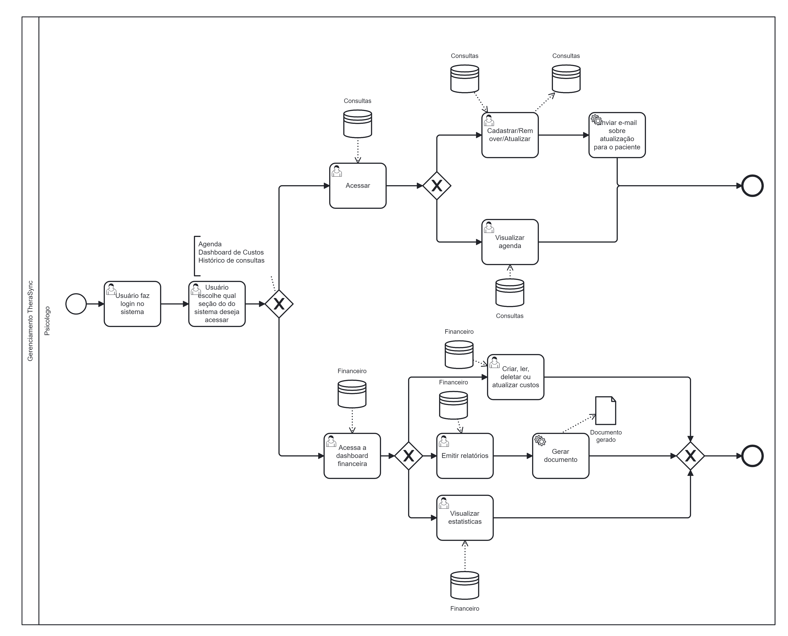
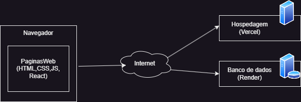
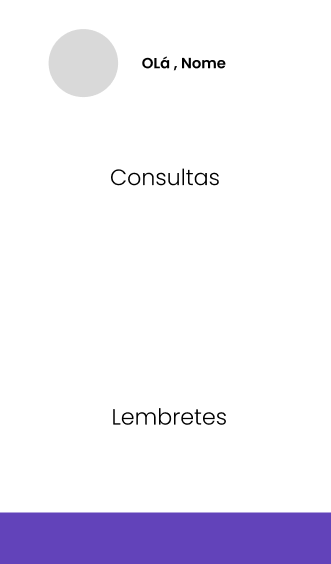
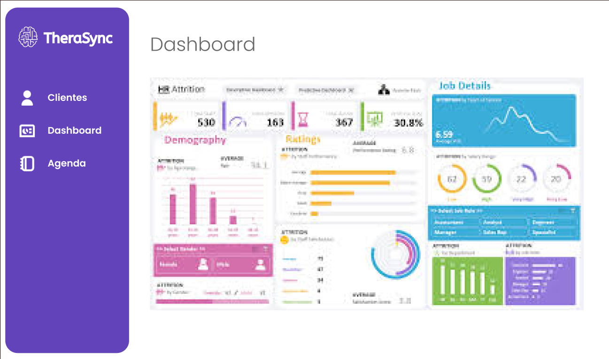
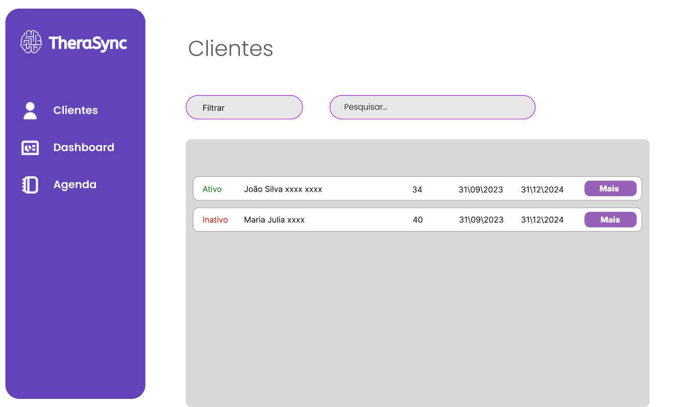
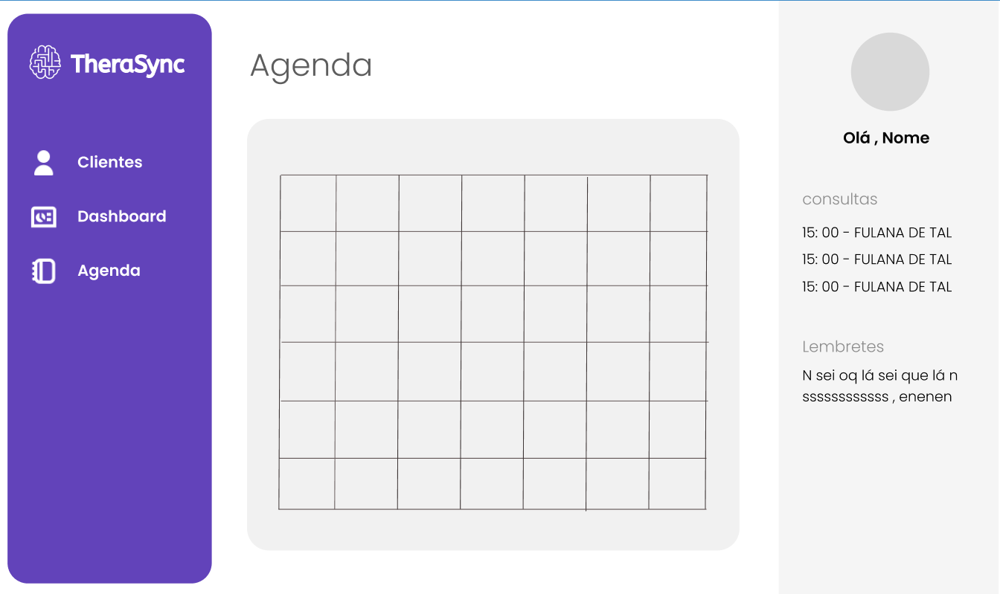
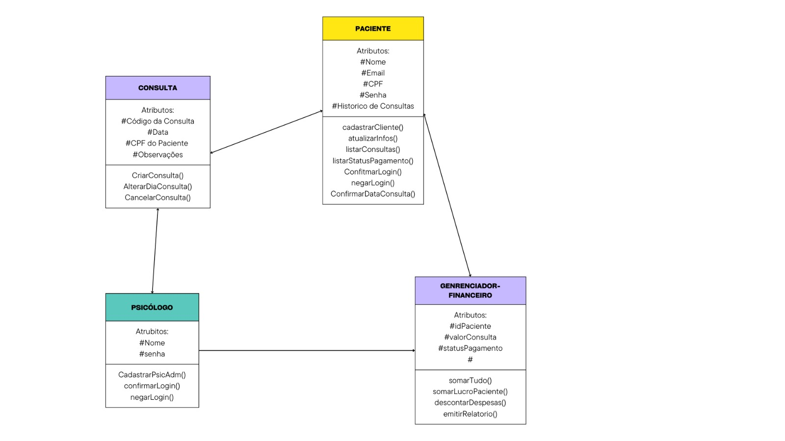
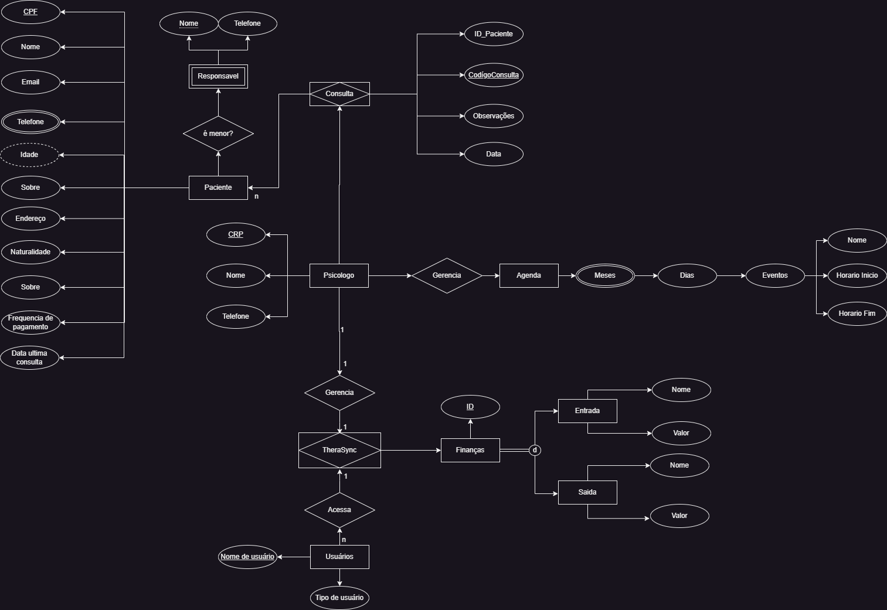
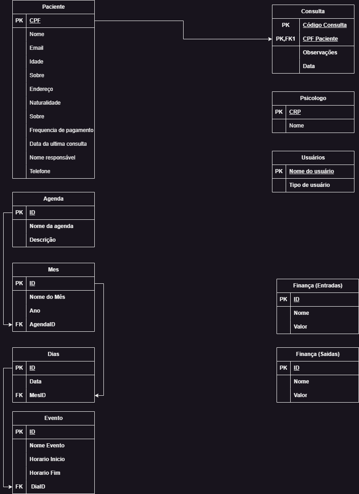

# TheraSync

`Sistemas de Informação`

`Trabalho Interdisciplinar: Aplicações de Processos e Negócios `

`3° Semstre`

O Projeto irá consistir na construção de uma landing page, um sistema nomeado TheraSync, que tem como objetivo ajudar o gerenciamento do trabalho do psicólogo com cadastro de clientes, cronograma/agenda, e um dashboard de controle financeiro. 

## Integrantes

* Gustavo Milagres da Costa
* Grazielle Sorrentino Santos Souza
* Luan Magno Souza Alves
* Amor Thedim Neto Ferreira

## Orientador

* Leonardo Vilela Cardoso

## Instruções de utilização

Assim que a primeira versão do sistema estiver disponível, deverá complementar com as instruções de utilização. Descreva como instalar eventuais dependências e como executar a aplicação.

# Documentação

<ol>
<li><a href="docs/1-Contexto.md"> Documentação de Contexto</a></li>

# Introdução
O Projeto irá consistir na construção de uma landing page, um sistema nomeado TheraSync, que tem como objetivo ajudar o gerenciamento do trabalho do psicólogo com cadastro de clientes, cronograma/agenda, e um dashboard de controle financeiro. 

## Problema
Um dos principais problemas relatados pelo cliente foi que atualmente as plataformas que ele utiliza para divulgação do seu serviço além de serem caras, limitam a apresentação do seu trabalho como psicoterapeuta e o preço no qual ele pode cobrar pelas consultas de preço social, reduzindo muito o público-alvo do seu trabalho. A fim de resolver esse problema a landing page traz a possibilidade de resolver tais questões de divulgação e captação de clientes, mas o problema não fica só aí, o cliente relatou também questões como a dificuldade de as vezes sempre lembrar das consultas marcadas, gerenciamento financeiro e a desejo de lembrar mais sobre dados dos clientes que atende, surgindo aí a ideia do sistema de gerenciamento para estas questões gerais, que apresenta base de clientes, dashboard para acompanhamento de estados financeiros e métricas sobre clientes, e uma agenda virtual. 

## Objetivos
O TheraSync tem como objetivo principal conectar pacientes e psicólogos de forma eficiente, ao mesmo tempo em que proporciona aos profissionais de saúde mental as ferramentas necessárias para a gestão completa de seus negócios. A plataforma busca simplificar o processo de atendimento e melhorar a experiência tanto para pacientes quanto para profissionais, unificando funcionalidades essenciais em um único lugar. 

## Justificativa
Segundo a Organização Pan-Americana da Saúde, em 2020, houve um aumento de aproximadamente 35% nos casos graves de depressão e de 32% nos transtornos de ansiedade. Dados do Ministério da Saúde revelam que, entre 2019 e 2023, o número de pessoas com ansiedade generalizada na rede pública cresceu mais de 200%. Além disso, um levantamento realizado pelo Conselho Federal de Psicologia (CFP) aponta que os honorários médios de um psicólogo variam entre R$222,00 e R$425,00, valores que se tornam inviáveis para a maior parte da população brasileira.
Diante desse cenário, o Sistema Único de Saúde (SUS) enfrenta grandes desafios: com apenas 19 psicólogos para cada 100 mil habitantes, o SUS não consegue suprir a demanda crescente por atendimento psicológico. Nesse contexto, os atendimentos a preço social desempenham um papel fundamental, proporcionando acesso a quem não tem condições financeiras de arcar com os custos tradicionais e que necessita de atendimento mais imediato.

## Publico-Alvo
Pacientes em busca de atendimento psicológico: Pessoas que estão procurando por profissionais da psicologia para atendimento. Esse público pode incluir indivíduos de todas as idades que buscam apoio psicológico, terapia ou acompanhamento em saúde mental. A plataforma servirá para apresentar as especialidades e metodologia de atendimento, oferecendo também o agendamento de consultas de forma prática. Psicólogos e Profissionais de Saúde Mental: Psicólogos que precisam de uma ferramenta para gerenciar suas práticas e consultórios. Esse público inclui psicólogos autônomos, pequenas clínicas de psicologia, e outros profissionais de saúde mental que desejam uma solução integrada para gerenciar seus atendimentos, agendamentos, registros de pacientes, finanças, faturamento, e outras atividades relacionadas ao gerenciamento de seus negócios. 

   
<li><a href="docs/2-Especificação.md"> Especificação do Projeto</a></li>

## Personas

Persona 1: João Victor um psicólogo recém formado que iniciou recentemente sua carreira como psicoterapeuta, dentro disso identificou uma necessidade de ter um meio de divulgação formal com o objetivo de captar mais clientes, atualmente páginas web podem aumentar em até 20% a captação de clientes então ele teria que optar por isso. Mas após o surgimento de vários clientes, foi de extrema necessidade obter um sistema capaz de ajudá-lo a organizar seu negócio. 

Persona 2: Joana Martins identificou falta de apetite e desleixo com seu autocuidado, por se encontrar em uma condição de vulnerabilidade social, decidiu procurar atendimento psicológico a custo social. 

Persona 3: Marta Silva é uma psicóloga que atende a mais de 7 anos no seu consultório pessoal, não é de hoje que ela vem notando que embora tenha bastante clientes não tem tido retornos satisfatórios do seu negócio, sua falta de organização e problemas de gestão vem gerando transtornos financeiros e na sua vida pessoal. Dessa forma ela decidiu adotar um sistema de gerenciamento que permite com que ela organize melhor seus horários além de conseguir insights valiosos sobre o gerenciamento financeiro. 

## Histórias de Usuários

Com base na análise das personas forma identificadas as seguintes histórias de usuários:

|EU COMO... `PERSONA`| QUERO/PRECISO ... `FUNCIONALIDADE` |PARA ... `MOTIVO/VALOR`                 |
|--------------------|------------------------------------|----------------------------------------|
|Psicologo Adminstrador | Registrar meus gastos          | Gerenciar meu faturamento               |
|Psicologo Adminstrador | Cadastrar atendimentos na agenda| Organizar minha rotina de atendimentos |
|Psicologo Adminstrador | acessar informações dos clientes| Avisa-los de possíveis imprevistos |
|Paciente em potencial| Ver as informações do psicologo | Saber se ele atende minhas necessidades |

## Requisitos

### Requisitos Funcionais

|ID    | Descrição do Requisito  | Prioridade |
|------|-----------------------------------------|----|
|RF-001| O sistema deve permitir que clientes solicitem atendimento para o profissional| ALTA | 
|RF-002| O sistema deve contar com uma dashboard de gráfica para gerenciamento do negócio   | MÉDIA |
|RF-003| O sistema deve permitir que o psicologo agende atendimentos em sua agenda  | ALTA | 
|RF-004| O sistema deve permitir a criação de pacotes de serviço para diferentes clientes  | MÉDIA |
|RF-005| O sistema deve permitir que o psicologo faça anotações do cliente sobre o atendimento | ALTA | 
|RF-006| O sistema deve permitir a visualização do histórico de atendimentos  | MÉDIA |
|RF-007| O sistema deve gerar relatórios financeiros para o profissional | ALTA | 
|RF-008| O sistema deve enviar lembretes dos agendamentos para os profissionais  | MÉDIA |
|RF-009| O sistema deve ter um painel com o resumo das atividades do dia| ALTA | 
|RF-0010| O sistema deve permitir que o profissional faça login| MÉDIA |
|RF-0011| O sistema deve permitir que o profissional edite suas informações da landing page (especialidades, foto, formações, meios de contato) | ALTA | 
|RF-0012| O sistema deve permitir que profissionais enviem mensagens aos clientes por meio da plataforma.   | MÉDIA |

### Requisitos não Funcionais

|ID     | Descrição do Requisito  |Prioridade |
|-------|-------------------------|----|
|RNF-001| O sistema deve seguir as normas de privacidade de dados (LGPD).|  ALTISSIMA | 
|RNF-002| O sistema deve estar disponível 99,9% de tempo | ALTA | 
|RNF-003| O sistema deve ser responsivo para diversos dispositivos |  ALTA | 
|RNF-004| Deve processar requisições do usuário em no máximo 4s |  BAIXA | 

## Restrições

|ID| Restrição                                             |
|--|-------------------------------------------------------|
|01| O projeto deverá ser entregue até o final do semestre |
|02| O sistema feito não proverá manutenção futura por parte do grupo envolvido. |
|03| O sistema deve ser compatível com navegadores modernos (Chrome, Firefox, Edge).|

<li><a href="docs/3-Modelagem-Processos-Negócio.md"> Modelagem dos Processos de Negocio</a></li>  

No levantamento AS-IS, foi identificado que as ferramentas de gestão do cliente estão dispersas em diferentes aplicativos e serviços, o que torna o acesso às informações ineficiente e fragmentado. Este cenário evidencia os pontos fracos da abordagem atual, como a dificuldade em integrar dados e gerar insights eficientes para a gestão do negócio. Todos os elementos e fluxos relevantes da situação atual foram mapeados na modelagem AS-IS, refletindo com precisão o estado atual do processo.

O diferencial do projeto proposto (TO-BE) está na centralização dessas funcionalidades em um único ambiente, oferecendo ao cliente uma solução inovadora que possibilitará múltiplas visões de suas bases de dados de forma otimizada. Esta integração facilitará a gestão do negócio, reduzindo a dispersão de informações e permitindo uma tomada de decisão mais ágil e assertiva.

A modelagem TO-BE, alinhada aos objetivos estratégicos do projeto, apresenta uma visão clara e detalhada da situação futura, com melhorias bem definidas e justificadas. A proposta visa otimizar os processos ao consolidar todas as ferramentas em uma plataforma única, transformando a forma como o cliente acessa e gerencia suas informações. Quanto à sustentabilidade, a monetização poderá ser viabilizada por meio de um modelo de assinatura, licenciamento da plataforma ou customização de funcionalidades para atender necessidades específicas dos clientes.

## AS IS: 

  

<ol type="1">
   <li>O contato com o paciente é feito a partir do WhatsApp ou Instagram.</li>
   <li>Ao agendar uma consulta/entrevista, insere o compromisso no Google Agenda e em uma planilha excel de consultas e entrevistas.</li>
   <li>Avisa o cliente um dia antes da consulta no WhatsApp.</li>
   <li>Realiza a consulta.</li>
   <li>Em caso de consulta:     
      a. Realiza o registro no prontuário.  
      b. Adiciona na planilha financeira o valor da consulta.
   </li>
</ol>

  

<ol type="1">
   <li>Acessa uma planilha no Office 365</li>
   <li>Realiza as alterações desejadas</li>
</ol>

## TO BE:

### Uso TheraSync

  

<ol type="1">
   <li>Cliente acessar a plataforma via login.</li>
   <li>Escolher qual seção de gestão deseja acessar.</li>
      
2.1 Seção consultas.

      
2.1.1 CRUD consultas.

      
2.2 Visualizar agenda.

      
2.2 Dashboard Financeira.

      
2.2.1 CRUD Finanças.

      
2.2.2 Emitir relatórios.

      
2.2.3 Visualizar estátisticas.
  
</ol>

### Flow para consultas 

   

<ol type="1">
   <li>Paciente acessa o web site.</li>
   <li>Envia solicitação de entrevista para o psicologo.</li>
   <li>Aguarda o prazo da entrevista caso as necessidades estejam de acordo.</li>
</ol>

<ol type="1">
   <li>Acessa plataforma via login.</li>
   <li>Acessa a seção de agendamentos.</li>
   
2.1 Secão de entrevistas.

   
2.1.1 Responder solicitações.

   
2.1.2 Comparece na entrevista.

   <li>Seção de consultas</li>
   
3.1 Aguarda o prazo da entrevista

</ol>

### Consulta

   

<ol type="1">
   <li>Realiza a consulta o cliente pelo Google Meets</li>
   <li>Monta o relatório</li>
</ol>

#### Entrevista

   
<ol type="1">
   <li>Entrevista o cliente pelo Google Meets</li>
   <li>Monta o relatório</li>
</ol>

 

<li><a href="docs/4-Projeto-Solucao.md"> Projeto da solução</a></li> 

## 4.1. Arquitetura da solução

## 4.2. Protótipos de telas

### Tela inicial SmarthPhone

### DashBoard

### Listagem Clientes

### Agenda

## Diagrama de Classes

## Modelo ER

### Modelo Conceitual

### Modelo Lógico

### Modelo Fisico

-- Criação do banco de dados
create database TheraSync;

-- Criação tabela cliente
use therasync;

create table cliente (
cpf INT PRIMARY KEY,
nome varchar(50) NOT NULL,
email varchar(50) NOT NULL,
idade date,
sobre varchar(500),
naturalidade char(32),
frequenciaPagamento char(7) CHECK (frequenciaPagamento IN ('mensal', 'quinzenal', 'semanal')),
nomeResponsavel varchar(50)

-- Criação tabela consulta
use therasync;

create table consulta(
CodConsulta int,
id_paciente int ,
observacoesConsultas varchar(500),
dataConsulta date,
constraint FK_Cod_Consulta foreign key (id_paciente) references cliente(cpf),
primary key (CodConsulta, id_paciente)
);

-- Criação tabela Usuários
use therasync;

create table usuarios(
username varchar(15) not null primary key,
nivel char(15) check (nivel in ('psicologo', 'adm'))
);

-- Criação tabela agenda
use therasync;

create table agenda(
id int auto_increment primary key,
nomeAgenda varchar(15),
descricao varchar(30)
);

-- Criação tabela mes
use therasync;

create table mes(
idMes int auto_increment primary key,
mes varchar(9) unique key,
ano int,
AgendaID int,
constraint MesAgenda foreign key (AgendaID) references agenda(id)
);

-- Criação tabela dia
use therasync;

create table dias(
id int auto_increment primary key,
mesID int,
constraint diaMes foreign key (mesID) references mes(idMes)
);

-- Criação tabela eventos 
use therasync;

create table eventos (
id int auto_increment primary key,
nomeEvento varchar(15),
horarioInicio varchar(5),
horarioFim varchar(5),
diaID int,
constraint diaID foreign key (diaID) references dias(id)
);

-- Criação tabela Finanças Saidas
use therasync;

create table FinancasSaidas(
id int auto_increment primary key,
nome varchar (15),
valor decimal(10,2)
);

-- Criação tabela Finanças Entradas

use therasync;
create table FinancasEntradas(
id int auto_increment primary key,
nome varchar (15),
valor decimal(10,2)
);

### 4.4. Tecnologias

| **Dimensão**   | **Tecnologia**  |
| ---            | ---             |
| SGBD           |           |
| Front end      |          |
| Back end       |       |
| Deploy         |         |
| Design         |           |

<li><a href="docs/5-Gerenciamento-Projeto.md"> Gerenciamento do Projeto</a></li>  

## Quadro de tarefas
## Sprint 1

Atualizado em: 02/09/2024

| Responsável   | Tarefa/Requisito | Iniciado em    | Prazo      | Status | Terminado em    |
| :----         |    :----         |      :----:    | :----:     | :----: | :----:          |
| Neto | Levantamento de requisitos | 26/09/2024| 08/09/2024 | ✔️    | 02/09/2024|
| Grazielle | Apresentação    | 26/09/2024    | 08/09/2024 | ✔️    | 30/08/2024|
| Luan        | Contextualização | 26/09/2024     | 08/09/2024 |   ✔️     |02/09/2024|
| Gustavo        | Levantamento de dados e reportório | 26/09/2024 | 08/09/2024 | ✔️    | 01/09/2024   |

## Sprint 2

Atualizado em: 06/10/2024

| Responsável   | Tarefa/Requisito | Iniciado em    | Prazo      | Status | Terminado em    |
| :----         |    :----         |      :----:    | :----:     | :----: | :----:          |
| Neto       | Levantamento AS-IS         | 23/10/2024    | 16/10/2024 | ✔️    |23/09/2024|
| Grazielle  | Elaboração da Apresentação | 16/10/2024    | 06/10/2024 | ✔️    |04/10/2024|
| Luan       | Levantamento TO-BE         |16/10/2024     | 06/10/2024 | ✔️    |02/10/2024|
| Gustavo    | Levantamento TO-BE         | 16/10/2024    | 06/10/2024 | ✔️    |02/10/2024|

### Sprint 3

Atualizado em: 23/10/2024

| Responsável   | Tarefa/Requisito | Iniciado em    | Prazo      | Status | Terminado em    |
| :----         |    :----         |      :----:    | :----:     | :----: | :----:          |
| Neto       | Modelagem MER       | 16/10/2024    | 27/10/2024 | ✔️    |24/10/2024|
| Grazielle  | Protótipos de telas | 16/10/2024    | 27/10/2024 | ✔️    |21/10/2024|
| Luan       | Modelagem de processos|16/10/2024     | 27/10/2024 | ✔️    |25/10/2024|
| Gustavo    | Modelagem Relacional e criação de scripts| 16/10/2024    | 27/10/2024 | ✔️    |22/10/2024|

### Sprint 4

Atualizado em: 23/10/2024

| Responsável   | Tarefa/Requisito | Iniciado em    | Prazo      | Status | Terminado em    |
| :----         |    :----         |      :----:    | :----:     | :----: | :----:          |
| Neto       | Cadastro de usuarios - Back-end e front-end      | 11/11/2024    |17/10/2024 | ⌛    |24/10/2024|
| Grazielle  | CRUD Clientes - front e backend | 04/11/2024    | 17/10/2024 | ✔️    |16/11/2024|
| Luan       | Login - front-end e back-end| 11/11/2024     | 17/10/2024 | ✔️    |17/10/2024|
| Gustavo    | CRUD Dashboard - front-end e back-end| 04/10/2024    | 17/10/2024 | ✔️    |16/11/2024|

Legenda:
- ✔️: terminado
- 📝: em execução
- ⌛: atrasado
- ❌: não iniciado

<li><a href="docs/6-Interface-Sistema.md"> Interface do Sistema</a></li>

# 6. Interface do Sistema

## 6.1. Tela login

Sistema inicialmente entra nessa página em caso de login não autenticado

## 6.2 Tela Dashboard

Seção exibe alguns insights vindos diretamente do banco de dados, com faturamento mensal, podendo ser alterado pelo filtro e g´rafico com faturamento mensal

Seção exibe a listagem de gastos no banco

Seção exibe a listagem de ganhos no banco

## 6.2.1 Dashboard CREATE

Ao clicar no botão de inclusão, abre-se um modal com os campos, sendo todos obrigatórios.

## 6.2.2 Dashboard Resultado

Resultado esperado é a inclusão dos dados e exibição nos insights relacionados

## 6.3 Tela Clientes

Seção exibe a listagem dos pacientes

## 6.3.1 Clientes Exibir Mais

Modal que exibe o restante das informações do paciente

## 6.3.2 Editar Clientes

Modal para edição de algumas informações

## 6.3.2 Editando Clientes

## 6.3.2 Resultado edição

Resultado da edição

## 6.3.3 Clientes Filtro A-Z

Resultado do filtro A-Z

<li><a href="docs/7-Conclusão.md"> Conclusão</a></li>
<li><a href="docs/8-Referências.md"> Referências</a></li>

Organização Pan-Americana da Saúde. Saúde mental deve estar no topo da agenda política pós-COVID-19, diz relatório da OPAS. Acesso em 25/08/2024. <a href="https://www.paho.org/pt/noticias/9-6-2023-saude-mental-deve-estar-no-topo-da-agenda-politica-pos-covid-19-diz-relatorio-da#:~:text=relat%C3%B3rio%20da%20OPAS-,Sa%C3%BAde%20mental%20deve%20estar%20no%20topo%20da%20agenda%20pol%C3%ADtica%20p%C3%B3s,19%2C%20diz%20relat%C3%B3rio%20da%20OPAS&text=O%20documento%20destaca%20que%20a,regi%C3%A3o%2C%20foi%20exacerbada%20pela%20pandemia.">Link </a> 
Conselho Federal de Psicologia/Fenapsi. Elaboração: DIEESE. Acesso em 01/09/2024. <a href="https://site.cfp.org.br/servicos/tabela-de-honorarios/">Link </a>
Associação Médica Brasileira. Apenas 5% dos brasileiros fazem terapia, mas 1 a cada 6 usam medicamentos, mostra pesquisa inédita sobre saúde mental. Acesso em 01/09/2024. <a href="https://amb.org.br/brasilia-urgente/apenas-5-dos-brasileiros-fazem-terapia-mas-1-a-cada-6-usam-medicamentos-mostra-pesquisa-inedita-sobre-saude-mental/">Link </a>

</ol>

# Código

<li><a href="src/README.md"> Código Fonte</a></li>

# Apresentação

<li><a href="presentation/README.md"> Apresentação da solução</a></li>

## Histórico de versões

* 0.1.1
    * CHANGE: Atualização das documentações. Código permaneceu inalterado.
* 0.1.0
    * Implementação da funcionalidade X pertencente ao processo P.
* 0.0.1
    * Trabalhando na modelagem do processo de negócio.

